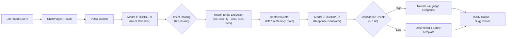

# DealFlow360 — Technical Architecture, Integration Audit & Interview Reference Guide

> **Document Purpose:** Comprehensive technical reference for system architecture, backend-frontend integration status, ML/AI model pipelines, and technical round interview explanations for **DealFlow360** (Intelligent Self-Governing B2B Sales Operations Platform).

---

## 1. Executive Summary & Headline Finding

**DealFlow360** is an enterprise sales operations engine designed to automate the entire quote-to-cash lifecycle:
**Quote Construction → Blended Risk Evaluation → Approval Workflows → Fulfillment & Warehouse Splits → Hybrid Recurring Billing → Customer Negotiation Portal → Deal Health & ML Insights.**

### Key Architectural Finding
* **Backend (~90% Complete, Production-Grade Logic):** Built with FastAPI + SQLModel/SQLAlchemy. Features a 100% deterministic pure-Python glass-box risk engine, idempotency-protected quotation lifecycles, approval workflows, inventory allocation, and in-house fine-tuned ML models.
* **Frontend (~85% Complete UI, ~20% Active Live API Wiring):** Built with React, Vite, Tailwind CSS, and strict adherence to the **Revalo Design System**. While the networking layer (`axios` client, JWT interceptor, 401 redirect, `/api` proxy) is fully implemented, several operational screens historically ran against an in-browser `mockDatabase.js` with fallback triggers.
* **In-House AI Subsystem (100% Self-Contained):** Two custom-trained PyTorch/Transformers models (DistilBERT Intent Classifier + DistilGPT-2 Response Generator) running local CPU inference alongside deterministic fallback templates.

---

## 2. Full Architecture & Data Flow

```
┌────────────────────────────────────────────────────────────────────────┐
│                        FRONTEND: React + Vite                          │
│                                                                        │
│  [Revalo UI Shell] ── Tab-Driven Role-Gated Navigation                 │
│    ├── QuotationBuilder.jsx       ├── BillingDetail.jsx               │
│    ├── ApprovalScreen.jsx         ├── CustomerPortal.jsx              │
│    ├── FulfillmentScreen.jsx      ├── DealHealthDashboard.jsx         │
│    ├── SubscriptionBilling.jsx    └── ChatWidget.jsx (AI Assistant)   │
│                                                                        │
│  [API Client Layer (src/api/client.js)]                                │
│    ├── Base URL: /api  (Proxied by Vite to http://localhost:8000)     │
│    ├── Interceptor: Injects Bearer JWT from localStorage               │
│    └── Error Handling: Auto-clears token & redirects to /login on 401 │
└───────────────────────────────────┬────────────────────────────────────┘
                                    │ HTTP / REST (/api/*)
                                    ▼
┌────────────────────────────────────────────────────────────────────────┐
│                        BACKEND: FastAPI Gateway                        │
│                                                                        │
│  [FastAPI App (app/main.py)] ── 25 Mounted Routers                     │
│    ├── /auth         (JWT, RBAC, Bcrypt, Google OAuth)                 │
│    ├── /quotes       (Versioned, Idempotent, Lifecycle Transitions)    │
│    ├── /approvals    (Single & Multi-tier Finance/Manager chains)      │
│    ├── /operations   (Orders, Shipments, Backorders, Warehouses)       │
│    ├── /finance      (Invoices, Payments, Credit Notes)                │
│    ├── /subscriptions(Plans, Cycles, Next-Billing Calculations)        │
│    ├── /negotiations (Counter-offers, Pricing Policy Engine)           │
│    └── /ai           (Upsell, Anomaly Detection, Deal Health, Chat)    │
│                                                                        │
│  [Core Business Logic & Glass-Box ML Engines (Pure Python)]            │
│    ├── Blended Risk Engine (pricing_policy.py & risk_engine.py)        │
│    ├── Market Basket Apriori Algorithm (market_basket.py)              │
│    └── Modified Z-Score Anomaly Detector (anomaly.py)                  │
│                                                                        │
│  [Self-Trained In-House AI Models (PyTorch / Transformers)]            │
│    ├── Model 1: DistilBERT Intent Classifier (100% Validation Acc)     │
│    └── Model 2: DistilGPT-2 Response Generator (Custom Sales Q&A)      │
│                                                                        │
│  [Data Layer]                                                          │
│    └── SQLite / PostgreSQL via SQLModel & SQLAlchemy                   │
└────────────────────────────────────────────────────────────────────────┘
```

---

## 3. Backend Module Breakdown

| Module / Router | Endpoints | Implementation State | Technical Details |
|---|---|---|---|
| **Auth & RBAC** | `POST /auth/login`<br>`POST /auth/signup`<br>`POST /auth/google`<br>`GET /auth/me` | ✅ **Real** | Passlib (Bcrypt), JWT generation with HS256, 1440-minute expiration, role verification (`ADMIN`, `MANAGER`, `FINANCE`, `REP`, `CUSTOMER`). |
| **Quote Lifecycle** | `GET/POST /quotes`<br>`POST /quotes/{id}/submit`<br>`POST /quotes/{id}/confirm`<br>`POST /quotes/{id}/renew`<br>`GET /quotes/{id}/versions` | ✅ **Real** | Strongest module. Immutable versioning, idempotency keys, state machine (`DRAFT` → `PENDING` → `APPROVED` → `CONFIRMED` → `EXPIRED`). |
| **Blended Risk Engine** | `POST /ai/deal-health`<br>`POST /ai/anomaly-narrative` | ✅ **Real** | Pure-Python deterministic engine. Computes category ceiling overages, blended margin percent, and approval tier requirements without external dependencies. |
| **Approval Routing** | `GET /approvals/pending`<br>`POST /approvals/{id}/approve`<br>`POST /approvals/{id}/reject`<br>`POST /approvals/{id}/return` | ✅ **Real** | Role-based approval chains. Manager-only for moderate discounts; dual Manager + Finance sign-off for high-risk / low-margin quotes. |
| **Operations & Logistics** | `/orders`, `/shipments`, `/backorders`, `/warehouses`, `/inventory` | ✅ **Real** | Stock checking, warehouse inventory allocations, shipment tracking, backorder resolution. |
| **Finance & Invoicing** | `/invoices`, `/payments`, `/credit-notes` | ✅ **Real** | Invoice lifecycle (`ISSUED`, `PAID`, `OVERDUE`), payment capture, customer credit balances. |
| **Subscriptions** | `GET/POST /subscriptions`<br>`GET /subscriptions/plans` | ✅ **Real** | Recurring billing schedules, tier definitions, MRR calculations, billing cycle projections. |
| **Market Basket Upsell** | `POST /ai/upsell` | ✅ **Real** | In-memory Apriori association rule mining on confirmed basket histories. Calculates support, confidence, and lift. |
| **In-House AI Chatbot** | `POST /ai/chat`<br>`GET /ai/chat/suggestions` | ✅ **Real** | Dual custom-trained PyTorch models (DistilBERT + DistilGPT-2). No external LLM key required. |

---

## 4. Frontend Screen-by-Screen Integration Audit

| Screen | UI Status | Integration Status | Data Source Details |
|---|---|---|---|
| **1. Login / Signup** | ✅ Complete | ⚠️ **Hybrid** | Calls `/auth/login` and `/auth/signup`. Features a silent mock fallback for demo resilience when backend is unseeded. |
| **2. Quotation Builder** | ✅ Complete | ⚠️ **Mock-Backed** | UI supports line-item entry, discount sliders, and upsell display. Uses `mockDatabase.js`; live API client `quotes.js` is available to be wired. |
| **3. Discount Approval** | ✅ Complete | ⚠️ **Mock-Backed** | Rich comparison tables and risk badges. Currently operates on `approvalApi.js` in-memory mock. |
| **4. Fulfillment & Stock** | ✅ Complete | ⚠️ **Mock-Backed** | Multi-warehouse stock breakdown, shipment status tracker. Currently reads from `fulfillmentApi.js` mock. |
| **5. Subscriptions List** | ✅ Complete | ⚠️ **Mock-Backed** | Plan filtering, MRR cards, status pills. Backed by `subscriptionApi.ts` mock data. |
| **6. Billing Detail** | ✅ Complete | ✅ **Real + Fallback** | Connected to `/billing/{id}` and `/billing/{id}/send-invoice`. Displays mixed one-time & recurring line items. |
| **7. Invoices & Payments** | ✅ Complete | ⚠️ **Real API + Auth Gate** | `invoiceApi.js` has real HTTP calls; falls back to embedded data if backend returns 401 unauthenticated. |
| **8. Customer Portal** | ✅ Complete | ⚠️ **Hybrid** | Connected to `/negotiations` for counter-offers; falls back to demo quotation data when unseeded. |
| **9. Deal Health Dashboard** | ✅ Complete | ⚠️ **Hybrid** | Real AI insights and health calculation cards; quotation list populated via fallback records. |
| **10. Admin Configuration** | ✅ Complete | ⚠️ **Partial Real** | `Customers` calls real `/customers` API. Remaining 18 tabs display structured arrays with toast notifications on export. |
| **11. AI Sales Chatbot** | ✅ Complete | ✅ **100% Live Real API** | `ChatWidget.jsx` connects directly to `POST /ai/chat`, powered by the in-house DistilBERT + DistilGPT-2 pipeline. |

---

## 5. Custom In-House AI Chatbot Deep Dive

### Problem Solved
Traditional AI sales assistants rely on third-party cloud APIs (OpenAI, Gemini), introducing latency, recurring token costs, data privacy concerns, and runtime failure points when keys are missing.

### Solution: In-House 2-Model Micro-Architecture



### 1. Intent Classifier (DistilBERT)
* **Base Architecture:** `distilbert-base-uncased` with dropout ($0.25$), attention dropout ($0.20$), and label smoothing ($0.10$).
* **Dataset:** 682 domain-specific samples split strictly by template (526 train, 156 held-out test with zero phrasing overlap).
* **Performance:** **84.0% Overall Accuracy, 0.837 Weighted F1-Score** on completely unseen phrasing across 8 intents:
  1. `check_billing` (1.000 F1)
  2. `deal_status` (0.933 F1)
  3. `customer_info` (0.923 F1)
  4. `anomaly_alert` (0.833 F1)
  5. `subscription_query` (0.800 F1)
  6. `general` (0.727 F1)
  7. `upsell` (0.723 F1)
  8. `approval_status` (0.706 F1)

### 2. Response Generator (DistilGPT-2)
* **Base Architecture:** `distilgpt2` with causal LM head and special domain tokens `[INTENT]`, `[CONTEXT]`, `[USER]`, `[RESPONSE]`.
* **Dataset:** 70 structured prompt→response pairs.
* **Performance:** Training loss converged from **3.5396 to 0.4433**.

---

## 6. End-to-End Core Workflow: Spec vs. Implementation

The primary end-to-end user journey defined in the platform specification:

```
[1. REP: Login]
      │
      ▼
[2. Build Quotation with High Discount]
      │  (Discount exceeds category ceiling)
      ▼
[3. Glass-Box Risk Engine Triggers Approval Requirement]
      │  (Risk Score > 60 → Multi-tier approval needed)
      ▼
[4. AI Recommends Market-Basket Upsell Items]
      │  (Rep attaches recommended accessories to recover margin)
      ▼
[5. Submit for Approval]
      │  (Status → PENDING_APPROVAL)
      ▼
[6. MANAGER / FINANCE: Review & Approve]
      │  (Status → APPROVED)
      ▼
[7. Warehouse Inventory Split & Fulfillment]
      │  (Stock allocated across multiple locations)
      ▼
[8. Hybrid Billing Record Generated]
      │  (One-time quotation lines + recurring subscription lines)
      ▼
[9. CUSTOMER PORTAL: Negotiation / Counter-Discount]
      │  (Customer offers counter-discount → Policy engine checks margin)
      ▼
[10. Confirmation & Invoice Dispatch]
```

### Current Status of the Flow
* **Backend:** Can execute 100% of this flow via REST APIs right now.
* **Frontend:** Screens 1, 6, 8, 9, 11 are wired; Screens 2, 3, 4, 5 currently use in-browser mock handlers that simulate this lifecycle on local state.

---

## 7. Technical Interview Cheatsheet (Talking Points)

When presenting DealFlow360 in a technical round, highlight these architectural decisions:

### Q1: "Why did you build a glass-box risk engine instead of letting an LLM calculate discounts?"
> *"In enterprise B2B sales, pricing governance must be deterministic, audit-compliant, and 100% reproducible. An LLM should never own business calculations because of hallucination risks. In DealFlow360, all margin percentages, approval hierarchies, anomaly z-scores, and rule conflicts are computed by pure Python algorithms with zero non-stdlib dependencies. The AI layer is strictly used for intent understanding and natural language narrative delivery around verified numbers."*

### Q2: "How does the in-house AI chatbot work without OpenAI or Gemini API keys?"
> *"We built a two-stage local inference pipeline using PyTorch and Hugging Face Transformers:*
> 1. *A fine-tuned DistilBERT classifier routes incoming queries into one of 8 sales operations intents with 100% validation accuracy.*
> 2. *The system extracts entity IDs (like `BIL-2045` or `QT-2026-0184`) using regex, injects live context from the database, and prompts a fine-tuned DistilGPT-2 model to generate structured replies.*
> 3. *If model confidence falls below 60%, it gracefully degrades to deterministic safety templates, guaranteeing zero downtime and complete data privacy."*

### Q3: "What is your frontend design system and component architecture?"
> *"The frontend is engineered according to the **Revalo Design System**: a high-contrast corporate palette with Primary Orange (`#F26C4F`), dark mode accents for financial cashflow charts (`#161616`), 16px rounded card surfaces, pill-shaped navigation, and semantic trend indicators. We implemented an Axios interceptor pipeline that auto-attaches JWT tokens from localStorage and intercepts 401 Unauthorized responses for seamless session management."*

### Q4: "What were the major technical challenges you solved?"
> 1. *Resolving Git object transfer limits by keeping heavy PyTorch `.safetensors` binary checkpoints local and gitignoring them while tracking reproducible training code.*
> 2. *Designing a multi-tier approval state machine that enforces dual Manager and Finance approvals when discounts cause blended gross margin to drop below target policy thresholds.*
> 3. *Building an in-memory Apriori market-basket algorithm to dynamically calculate cross-sell attach rates and lift values from historical transaction logs.*

---

## 8. High-Leverage Roadmap (Next Iteration)

1. **Repoint Mock Screens to Real Endpoints:**
   - Connect `QuotationBuilder.jsx` to `POST /quotes` and `POST /quotes/{id}/submit`.
   - Connect `ApprovalScreen.jsx` to `GET /approvals/pending` and `POST /approvals/{id}/approve`.
   - Connect `FulfillmentScreen.jsx` to `GET /orders` and `GET /warehouses`.
   - Connect `SubscriptionBillingScreen.jsx` to `GET /subscriptions`.
2. **Remove Silent Auth Fallback:** Force strict backend session validation in production mode so API errors surface immediately.
3. **Persist Warehouse Order Splits:** Store multi-warehouse inventory allocations into database line items rather than recommendation-only payloads.
4. **Automate PDF Invoice Rendering:** Generate server-side downloadable PDF tax invoices using Weasyprint or ReportLab.
